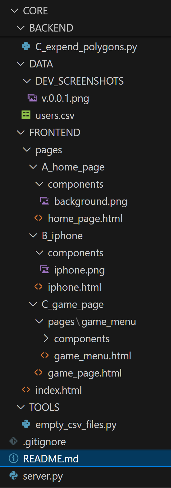

<h1 align="center">🧩 CrazyWalk-Game</h1>

<p align="center">
  <b>CrazyWalk</b> is a geolocation-based exploration and territory capture game.<br/>
  Navigate real-world streets, collect items, and complete polygons to expand your map.<br/>
  Powered by OpenStreetMap • Python Backend • Pure HTML/JS Frontend<br/>
</p>

<p align="center">
  <!-- GitHub badges -->
  <a href="https://github.com/israice/CrazyWalk-Game/stargazers">
    
  </a>
  <a href="https://github.com/israice/CrazyWalk-Game/forks">
    
  </a>
  
</p>


## 🚀 Live Website

> **Try it instantly:**  
> https://crazywalk.weforks.org/

### Last Dev Update
- v0.0.1 - project folders and files structure created


<!-- ---------------------- -->

<details>
  <summary>CrazyWalk Dev Roadmap</summary>

### home page
- login page with email and password button
- group of cocial icons with comming soon sign
- button for web3 entry with comming soon sign
- white guest button
 - if gueast read ID from loacalstorage if not exist create in csv and save ID in localstorage
- buttom header with city name
- terms and conditions button with comming soon sign
- video button with comming soon video
- icon leaderboard

### login using email page
- email and password input
- login finish button
- if user not exist redirect to register page
- after user aprroved get boh at ones
    - popup block with text and image 'welcome to CrazyWalk' 
    - this massage will временно отвлечет пользователя от загрузки данных in background
    - same time make 1 map request using settings.yaml coordinates
    - after 5 seconds hide popup block and show allready existing map with data from server so user will not fill any loading process 

### game page
- menu with sendwich icon
- map with userMarker always on center of the screen
- if large screen display iphone image with map on center of the screen
- if small screen display without iphone image
- when zoom out dont hide only userMarker and finished polygons, on full zoom in, show all as was 
- when keyboards keys move userMarker moving to circle next to him in same way as green lines going


## map processing
- use settings.yaml coordinates to OpenStreetMap
- gif userMarker with buttom circle from file userMarker.html userMarker.gif

## red lines
- make red lines over the roads in visible area
## blue circles
- make blue circles on crossings of red lines
## green lines
- make red line to green line between two blue circles
- make green circles over green line
## combined units 
- save green line and two blue circles and all green circles to csv as units
## polygons
- use the units to build polygons
- save polygons to csv with his units
## polygon center 
- on polygon add one circle in the middle of the polygon
- from all polygon circles round him make them as 100% of polygon
- on his border add another white circle 2 time bigger the first
- inside large white circle display gif with url from csv
## merge polygons
- must be both inside the polygon if not, merge polygons with closest 0
- each time user moving to circle, that circle will go hidden
## finished polygons
- when no hidden circles left around polygon make polygon green and hide white circles in his center and polygons green lines
- when blue circle have all his polygons around change blue to orange

## expend map
- when userMarker on blue circle, expend the map to his missing polygons
- if after request the are no missing polygons, make bigger request to get all missing polygons
- if limit request reached update via red massage under userMarker
- when userMarker on orange circle, dont expend the map

## database tables 
- create users.csv
- create usersTypes.csv
- create promoUsers.csv
- create adminUsers.csv
- create guestUsers.csv

## collection images
- change green polygons to half transparent images
- update user collection in csv

## promo GIF
- on mouse over polygon move the polygon 2px upper and right and on buttom make shadow
- on click on polygon make white popop with 'polygon next month price', 'polygon freedom status', 'polygon owner', 'global promo price'.

## large polygons detection
- if not water
    - when trying to expend map and request didnt create any new polygons next to same blue circle
        - make more 1 request with bigger radius
        - if still no polygons, use last red lines to make large red line on end of poligon as unit line
        - create the defaultPolygon using the large red line as unit line and save polygon in csv
- if water 
    - on click request defaultPolygon from csv
    - if not exist create 8x8 circles to create polygon 
        - start from large red line or expend from existing defaultPolygon
        - save new polygons to csv

<!-- ---------------------- -->

# other pages

## game menu icon
- sendwich icon in right side of the screen
- when clicked show menu with 4 icons
- icon settings
- icon leaderboard
- icon myCollections
- icon logout


## game stats page
- ammount of registered users
- ammount of guests
- ammount of now connected users
- ammount of total promoUsers
- ammount of total users
- ammount of all collected USD
- ammount of not yet discovered USD
- ammount of jackpot

## leaderboard page
- jackpot icon and text
- table with users 
    - nickname 
    - total of started collections
    - total of finished collections 
    - total of winnings in USD

## collections page
- collections icon and text with header invested in collections
- page full collections list as table
- user can click on image to make it bigger
- calmn of discovered collections number
- when user entering page he founds his row in center of screen
- two tabs in top
    - my collections (default)
    - all collections

## register page
- email and password input
- register finish button
- if user not exist create in csv and save ID in localstorage
- if user exist redirect to login page

## roadmap page
- investors needed button
- table with roadmap updates
- global roadmap graphics

## investors needed page
- story page as kickstarter page
- total of invested
- total of income
- total of needed

## Tools
- empty_csv_files.py

</details>

<!-- ---------------------- -->

<details open>

  <summary>Dev</summary>


<details>

  <summary>Development Setup</summary>

### On Windows or Linux
```Bash
# On Windows start the DOCKER SOFTWARE FIRST!
git clone https://github.com/israice/CrazyWalk-Game.git
cd CrazyWalk-Game
docker compose -f docker-compose.dev.yml up --build
```
```Bash
# or run using python
git clone https://github.com/israice/CrazyWalk-Game.git
cd CrazyWalk-Game
python server.py
```

</details>

<!-- ---------------------- -->

<details>
  <summary>Production Setup</summary>

## For Linux
```Bash
# Step 1 - install cloudflared and login
```
```Bash
# Step 2 - Link the DNS record
## TUNNEL NAME: myTunnelName
## SUBDOMAIN: mySubdomain
## DOMAIN: myDomain

cloudflared tunnel create myTunnelName-tunnel

cloudflared tunnel route dns myTunnelName-tunnel mySubdomain.myDomain.com
```
```Bash
# Step 3 - add subdomain and port to config.yml
cd ~/.cloudflared/
nano config.yml
```
```Bash
- hostname: crazywalk.weforks.org
  service: http://10.0.0.5:80
```


```Bash
# Step 4 - restart cloudflared
docker restart cloudflared
```
```Bash
# Step 5 - Enter "Your Projects" folder first, then run the docker
git clone https://github.com/israice/CrazyWalk-Game.git
cd CrazyWalk-Game
docker compose -f docker-compose.prod.yml up --build -d
```
```Bash
# Resault
https://crazywalk.weforks.org
```

</details>

<!-- ---------------------- -->

<details>
  <summary>GitHub Webhook Setup</summary>

## Configure Webhook in GitHub

1. Go to your repository settings on GitHub.
2. Click on **Webhooks** -> **Add webhook**.
3. **Payload URL**: `https://crazywalk.weforks.org:9000/push_and_update_server` (Ensure port 9000 is exposed and routed correctly).
4. **Content type**: `application/x-www-form-urlencoded`.
5. **Secret**: Generate a strong secret and add it to your `.env` file or environment variables as `AUTOUPDATE_WEBHOOK_FROM_GITHUB`.
6. **Which events would you like to trigger this webhook?**: Select "Just the push event".
7. Click **Add webhook**.

## Server Configuration

Ensure your `docker-compose.prod.yml` has the `AUTOUPDATE_WEBHOOK_FROM_GITHUB` environment variable set. You can pass it when running docker compose:

```Bash
AUTOUPDATE_WEBHOOK_FROM_GITHUB="your_secret_here" docker compose -f docker-compose.prod.yml up -d --build
```
</details>

<!-- ---------------------- -->

<details>
  <summary>Github Cheetsheet</summary>

## dev icons

✅ ☑️ ✔️ ✳️ ❌ ❎ ✖️ 🔁 🔂 🔄
🚀 ⚙️ 💻 🔥 🧪 🐞 📝 🛠️ 🔄 🕒
📈 📉 🗂️ 📦 🎯 📚 🧰 🏁 🔔 💡
🛑 🔍 🏗️ 🧩 🧭 🛡️ 🍀 🌐 📢 🧯
🛫 🎉 🧿 🖥️ 💾 🧬 🧑‍💻 🧑‍🔬 📊 📋
📌 📎 🖱️ 🖨️ 🗃️ 📂 🗒️ 🛒 🧹 🖊️
🗑️ 🕹️ 🧲 🧱 🏷️ 🏆 🥇 📜 📅 🗓️ 🔗
🔒 🔓 🗝️ 🧊 🧞 🧺 🧳 📡 🏢 🏭
🏠 🏘️ 🏚️ 🌟 🎨 🧡 💙 💚 💛 💜
🩵 🩷 🔋 🧨 🧤 🧦 🧥 🧢 🧴 🧵
🧶 🛎️ 🛏️ 🛋️ 🚪 🚧 🚦 🚥 🚨 🚒
🚑 🚓 🗄️ 🗳️ 📫 📪 📬 📭 📮 📨
📩 📤 📥 📧 🔬 🔭 🕵️‍♂️ 🕵️‍♀️ 🧑‍🏫
🧑‍🔧 🧑‍🔩 🧑‍🎨 🧑‍🚀 🧑‍✈️ 🧑‍🚒 🧑‍⚕️ 🧑‍🎤 🔨 🔧
🔩 🗜️ 🖲️ 💾 💿 📀 📼 🧫 ⚡ 🌀
🌪️ 🛸 🎲 🎮 🐛 🐜 🦠 ⏫ ⏬ ⏩
⏪ ⏭️ ⏮️ 🆗 🆕 🆙
🪙 🪙 💰 💴 💵 💶 💷 💸 💳 🏦
⚠️ ❗ ❕ ❓ ❔ ℹ️ ♻️ ⛔ 🚫
⬆️ ⬇️ ⬅️ ➡️ ↗️ ↘️ ↙️ ↖️ ⤴️ ⤵️ 
↩️ ↪️ 🔼 🔽 ▶️ ⏯️ ⏸️ ⏹️ ⏺️ ⏏️ 
◀️ 🔀 🔃 🔙 🔚 🔛 🔜 🔝 ➕ ➖ 
➗ ✴️ ❇️ ✨ ⭐ 🟢 🟡 🔴 🔵 ⚪
⚫ 🟣 🟤 🟧 🟥 🟦 🟩 🟨 🟪 🟫
⬛ ⬜ ◼️ ◻️ ◽ ◾ 💬 🗨️ 🗯️ 📞 
☎️ 📱 📲 📳 🔕 🔇 🔈 🔉 🔊 🎙️ 
🎚️ 🎛️ 🎧 📺 📻 📄 📃 📑 🧾 📰
🗞️ 📁 📇 🖇️ 📍 🧷 ✂️ 📏 📐 🧮 
🖋️ 🖌️ ⌨️ 💽 🔌 🔦 🛜 📶 🛰️ ☁️ 
🌩️ 🌫️ 🌤️ 🛢️ ⚗️ 🗺️ 🔑 🧠 🤖 🐧 
🐳 🧼 🧽 🪣 🪛 🪚 🪓 🪜 🪝 🪄 
🪟 🪠 🪪 🪫 🏧 💱 💲 🖧 🪬 🛍️

## see last 10 commits

```Bash
git log --oneline -n 10
```

## update repository

```Bash
git add .
git commit -m "v0.0.4 - create webhook from github to auto update server docker"
git push
```

</details>

<!-- ---------------------- -->

<details open>
  <summary>Dev Logs</summary>

[x] v0.0.1 - project folders and files structure created
- dev since 2022, dev from strach started 12.11.2025 
- full project step by step flow inside README.md
- create .gitignore file
- create github repository
- project first folders and files structure created

[X] v0.0.2 - test hello world docker on local
- hello world html page created
- docker compose file created

[X] v0.0.3 - prod docker on linux server
- added setup instructions to README.md
- test the subdomain crazywalk.weforks.org

[X] v0.0.4 - create webhook from github to auto update server docker
- added webhook server and dockerfile
- make pull on server to update

[] v0.0.5 - make a test commit to make sure server updated


</details>