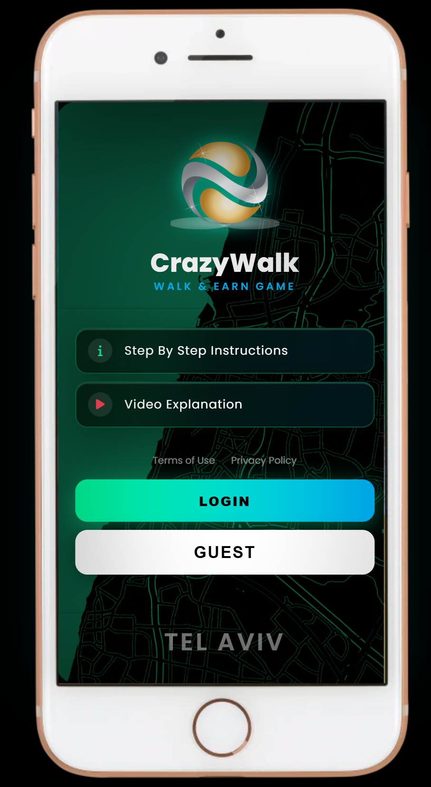
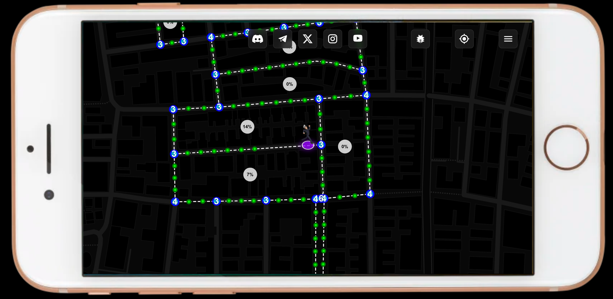
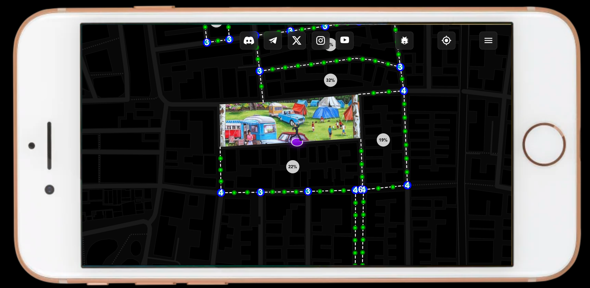
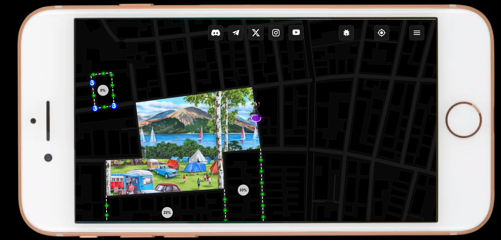
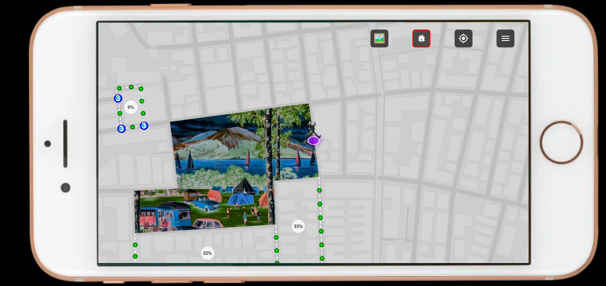
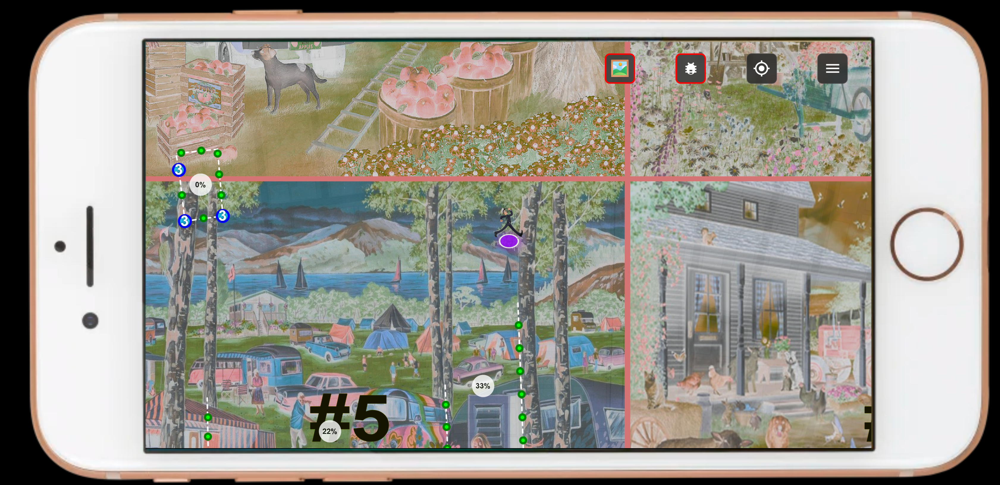
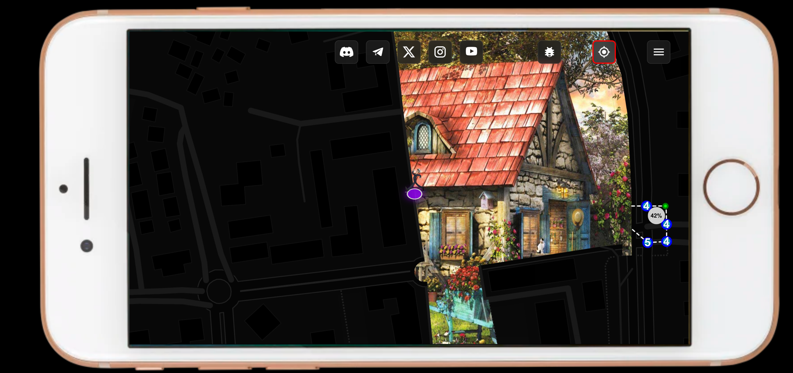

<h1 align="center">🧩 CrazyWalk-Game</h1>

<p align="center">
  <b>CrazyWalk</b> is a geolocation-based exploration and territory capture game.<br/>
  Navigate real-world streets, collect items, and complete polygons to expand your map.<br/>
  Powered by OpenStreetMap • Python Backend • Pure HTML/JS Frontend<br/>
</p>

<p align="center">
  <!-- GitHub badges -->
  <a href="https://github.com/israice/CrazyWalk-Game/stargazers">
    
  </a>
  <a href="https://github.com/israice/CrazyWalk-Game/forks">
    
  </a>
  
  
</p>

## 🚀 Live Website

> **Try it instantly:**  
> https://crazywalk.weforks.org/

### Last Dev Update

- v0.0.27 - added POSTERS instead finished polygons
<div align="center">
  
  
  
  
  
  
  
  
</div>

<!-- ---------------------- -->

[CrazyWalk Roadmap](https://github.com/israice/CrazyWalk-Game/blob/master/ROADMAP.md)

<!-- ---------------------- -->

<details open>

  <summary>Dev</summary>

- <details>

  <summary>Development Setup</summary>

  ### On Windows or Linux

  ```Bash
  # On Windows start the DOCKER SOFTWARE FIRST!
  git clone https://github.com/israice/CrazyWalk-Game.git
  cd CrazyWalk-Game
  docker compose -f docker-compose.dev.yml up --build
  ```

  ```Bash
  # or run using python
  git clone https://github.com/israice/CrazyWalk-Game.git
  cd CrazyWalk-Game
  python server.py
  ```

  </details>

<!-- ---------------------- -->

- <details>
  <summary>Production Setup</summary>

  ## For Linux

  ```Bash
  # Step 1 - install cloudflared and login
  ```

  ```Bash
  # Step 2 - Link the DNS record
  ## TUNNEL NAME: myTunnelName
  ## SUBDOMAIN: mySubdomain
  ## DOMAIN: myDomain

  cloudflared tunnel create myTunnelName-tunnel

  cloudflared tunnel route dns myTunnelName-tunnel mySubdomain.myDomain.com
  ```

  ```Bash
  # Step 3 - add subdomain and port to config.yml
  cd ~/.cloudflared/
  nano config.yml
  ```

  ```Bash
  - hostname: crazywalk.weforks.org
    service: http://10.0.0.5:80
  ```

  ```Bash
  # Step 4 - restart cloudflared
  docker restart cloudflared
  ```

  ```Bash
  # Step 5 - Enter "Your Projects" folder first, then run the docker
  git clone https://github.com/israice/CrazyWalk-Game.git
  cd CrazyWalk-Game
  docker compose -f docker-compose.prod.yml up --build -d
  ```

  ```Bash
  # Resault
  https://crazywalk.weforks.org
  ```

  </details>

<!-- ---------------------- -->

- <details>
  <summary>GitHub Webhook Setup</summary>

  ## Configure Webhook in GitHub

  1. Go to your repository settings on GitHub.
  2. Click on **Webhooks** -> **Add webhook**.
  3. **Payload URL**: `https://crazywalk.weforks.org/push_and_update_server`
  4. **Content type**: `application/json`.
  5. **Secret**: Generate a strong secret and add it to your `.env` file or environment variables as `AUTOUPDATE_WEBHOOK_FROM_GITHUB`.
  6. **Which events would you like to trigger this webhook?**: Select "Just the push event".
  7. Click **Add webhook**.

  ## Server Configuration

  Ensure your `docker-compose.prod.yml` has the `AUTOUPDATE_WEBHOOK_FROM_GITHUB` environment variable set. You can pass it when running docker compose:

  ```Bash
  # inside .env file
  AUTOUPDATE_WEBHOOK_FROM_GITHUB="your_secret_here"
  ```

  ```Bash
  docker compose -f docker-compose.dev.yml up -d --build
  ```

  </details>

<!-- ---------------------- -->

- <details>
  <summary>Dev Cheetsheet</summary>

  ## dev icons

  ✅ ☑️ ✔️ ✳️ ❌ ❎ ✖️ 🔁 🔂 🔄
  🚀 ⚙️ 💻 🔥 🧪 🐞 📝 🛠️ 🔄 🕒
  📈 📉 🗂️ 📦 🎯 📚 🧰 🏁 🔔 💡
  🛑 🔍 🏗️ 🧩 🧭 🛡️ 🍀 🌐 📢 🧯
  🛫 🎉 🧿 🖥️ 💾 🧬 🧑‍💻 🧑‍🔬 📊 📋
  📌 📎 🖱️ 🖨️ 🗃️ 📂 🗒️ 🛒 🧹 🖊️
  🗑️ 🕹️ 🧲 🧱 🏷️ 🏆 🥇 📜 📅 🗓️
  🔒 🔓 🗝️ 🧊 🧞 🧺 🧳 📡 🏢 🏭
  🏠 🏘️ 🏚️ 🌟 🎨 🧡 💙 💚 💛 💜
  🩵 🩷 🔋 🧨 🧤 🧦 🧥 🧢 🧴 🧵
  🧶 🛎️ 🛏️ 🛋️ 🚪 🚧 🚦 🚥 🚨 🚒
  🚑 🚓 🗄️ 🗳️ 📫 📪 📬 📭 📮 📨
  📩 📤 📥 📧 🔬 🔭 🕵️‍♂️ 🕵️‍♀️ 🧑‍🏫 🔗
  🧑‍🔧 🧑‍🔩 🧑‍🎨 🧑‍🚀 🧑‍✈️ 🧑‍🚒 🧑‍⚕️ 🧑‍🎤 🔨 🔧
  🔩 🗜️ 🖲️ 💾 💿 📀 📼 🧫 ⚡ 🌀
  🌪️ 🛸 🎲 🎮 🐛 🐜 🦠 ⏫ ⏬ ⏩
  ⏪ ⏭️ ⏮️ 🆗 🆕 🆙
  🪙 🪙 💰 💴 💵 💶 💷 💸 💳 🏦
  ⚠️ ❗ ❕ ❓ ❔ ℹ️ ♻️ ⛔ 🚫
  ⬆️ ⬇️ ⬅️ ➡️ ↗️ ↘️ ↙️ ↖️ ⤴️ ⤵️
  ↩️ ↪️ 🔼 🔽 ▶️ ⏯️ ⏸️ ⏹️ ⏺️ ⏏️
  ◀️ 🔀 🔃 🔙 🔚 🔛 🔜 🔝 ➕ ➖
  ➗ ✴️ ❇️ ✨ ⭐ 🟢 🟡 🔴 🔵 ⚪
  ⚫ 🟣 🟤 🟧 🟥 🟦 🟩 🟨 🟪 🟫
  ⬛ ⬜ ◼️ ◻️ ◽ ◾ 💬 🗨️ 🗯️ 📞
  ☎️ 📱 📲 📳 🔕 🔇 🔈 🔉 🔊 🎙️
  🎚️ 🎛️ 🎧 📺 📻 📄 📃 📑 🧾 📰
  🗞️ 📁 📇 🖇️ 📍 🧷 ✂️ 📏 📐 🧮
  🖋️ 🖌️ ⌨️ 💽 🔌 🔦 🛜 📶 🛰️ ☁️
  🌩️ 🌫️ 🌤️ 🛢️ ⚗️ 🗺️ 🔑 🧠 🤖 🐧
  🐳 🧼 🧽 🪣 🪛 🪚 🪓 🪜 🪝 🪄
  🪟 🪠 🪪 🪫 🏧 💱 💲 🖧 🪬 🛍️

  </details>

<!-- ---------------------- -->
</details>
